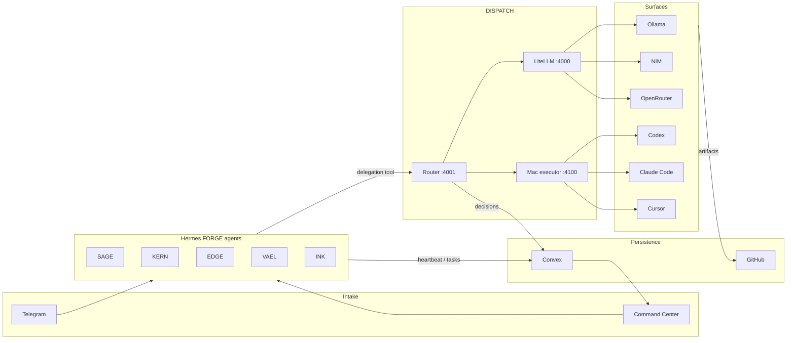

# FORGE Native Execution Plan (Lean)

Status: active — supersedes the Paperclip/Antfarm-first integration path in `FORGE_PRD_v1.4.md` for execution and work tracking.
Owner: Samuel (iCHRIS). Orchestration: KERN.
Last updated: 2026-07-05.

Pairs with:

- `docs/DISPATCH_HANDOFF.md` — live infrastructure, endpoints, and build state
- `docs/DISPATCH_BUILD_PLAN.md` — DISPATCH routing phases (0–7); routing is largely done
- `dispatch/dispatch.config.yaml` — tier/surface policy (edit data, not code)

## One-line architecture

**Telegram + Command Center → Hermes FORGE agents → DISPATCH router → Ollama / NIM / OpenRouter / Codex / Claude Code / Cursor → Convex log → Command Center visibility.**

Hermes owns intake, scheduling, skills, and agent identity. DISPATCH owns deterministic tier selection and surface failover. Convex owns durable work state and reactive UI. GitHub owns code truth.

## What is critical path vs reference-only

| Layer | Role | Critical path? |
|-------|------|----------------|
| **Hermes** | Live fleet, Telegram, cron, skills, sessions | **Yes** |
| **DISPATCH** | Tier-aware routing, failover, subscription-first billing | **Yes** |
| **Mac executor** | Headless Claude Code / Codex / Cursor in repo `cwd` | **Yes** |
| **LiteLLM** | API gateway for Ollama, NIM, OpenRouter, metered fallbacks | **Yes** |
| **Convex** | Work registry, routing log, live agent status, domain data | **Yes** |
| **Command Center** | Visibility, intake UI, domain dashboards (this repo) | **Yes** |
| **GitHub** | Repos, PRs, audit trail for shipped code | **Yes** |
| **Antfarm** | Multi-step CI-style agent pipelines (`plan → implement → verify → PR`) | **No** — keep workflow *patterns* (gates, retries, schema validation); implement a lightweight runner in Convex/Hermes when needed |
| **Paperclip** | Company OS (org, tickets, budgets, heartbeat, audit) | **No** — keep the *concepts*; build a lean **Convex FORGE Work Registry** first instead of running Paperclip as backend |

Do not block shipping on Antfarm install or Paperclip onboarding. When those patterns help, copy the shape into FORGE-native tables and Hermes skills.

## Minimal stack

Everything else is optional glue.

1. **Hermes** — `~/.hermes` → `Forge Core/.hermes`. Profiles: sage, kern, edge, vael, ink (+ scout/bridge idle).
2. **DISPATCH** — `dispatch/` in this repo; deployed LXC `192.168.1.178:4001`.
3. **Mac executor** — `dispatch/executor/executor.py`; live copy `~/.dispatch-executor/` on Mac `192.168.1.170:4100`.
4. **LiteLLM** — homelab LXC `:4000`; config `/opt/litellm/config.yaml`.
5. **Convex** — `convex/` in this repo; self-host on homelab when ready (Phase B).
6. **Command Center** — Vite + React 19 SPA; `npm run dev`, routes under `src/pages/`.
7. **GitHub** — client repos + this repo; PRs are the external audit for code changes.

## Operating rule: who does what

**DISPATCH executor surfaces (Claude Code, Codex, Cursor) implement coding and client work** — discrete, routable tasks with a clear prompt and optional `cwd`/`repo`.

**KERN orchestrates, verifies, and applies small targeted fixes** — does not monopolize large implementation passes. KERN:

- Triage and decompose work into delegatable units
- Call DISPATCH via `dispatch-delegate` skill or `dispatch/dispatch_delegate.py`
- Verify output (lint, smoke test, diff review)
- Apply or merge when correct; escalate to SAGE on policy/ambiguity
- Keep `docs/DISPATCH_HANDOFF.md` current after infrastructure changes

**Do not point Hermes agent model backends at DISPATCH.** Agents stay tool-calling on their subscription backend; DISPATCH is invoked as a **delegation tool** for specific tasks (see gotcha #1 in `DISPATCH_HANDOFF.md`).

## Phases A–F

These are the FORGE-native roadmap. DISPATCH build phases 0–7 (in `DISPATCH_BUILD_PLAN.md`) remain the routing sub-plan; many are already done.

### Phase A — First-class delegation

**Goal:** Any Hermes agent (starting with KERN, then SAGE) can delegate a bounded task to DISPATCH with repo context.

| Item | Status | Location |
|------|--------|----------|
| Router + LiteLLM + executor live | Done | `dispatch/`, LXC, Mac |
| `dispatch_delegate.py` CLI | Done | `dispatch/dispatch_delegate.py` |
| `cwd`/`repo` forwarding | Done | `dispatch/executor/executor.py`, router, service |
| Hermes `dispatch-delegate` skill (KERN) | Done | `~/.hermes/profiles/kern/skills/devops/dispatch-delegate/SKILL.md` |
| Copy skill to SAGE (and others as needed) | **Next** | Hermes profile skills dirs |
| Re-login Claude/Codex CLIs if auth smoke fails | **Next** | Mac mini |
| Document delegation contract in skill README | **Next** | skill + this doc |

**Done when:** KERN delegates a repo-scoped edit via Telegram or session, DISPATCH routes to a subscription CLI, result lands in git or a PR without KERN writing the bulk of the code.

### Phase B — Convex FORGE Work Registry

**Goal:** Replace Paperclip-as-backend with lean Convex tables for work tracking, without external company-OS dependency.

**New tables** (extend `convex/schema.ts`):

- `workItems` — id, title, description, source (telegram|command-center|cron|agent), state (backlog|ready|routing|running|review|done|blocked), priority, clientId?, assigneeAgent?, dispatchTaskId?, repo?, createdAt, updatedAt
- `workEvents` — workItemId, kind (created|delegated|routed|completed|failed|comment), actor, payload, createdAt (audit trail)
- `routingDecisions` — mirror DISPATCH log (taskId, category, complexity, chosenSurface, via, servedBy, latencyMs, status, considered[], createdAt)
- `agentHeartbeats` — extend or align with existing `agentStatus` (agentId, status, note, actionsToday, lastHeartbeatAt)

**Integrations:**

- DISPATCH router or a thin Convex action ingests `/decisions` or pushes on each route
- Hermes agents upsert heartbeats and transition `workItems` on delegate/complete
- Command Center `Tasks` / new Work page reads Convex reactively

**Done when:** A task created in Command Center or via Telegram appears in Convex, delegation updates its state, routing decisions are queryable, no Paperclip required.

### Phase C — Execution cockpit

**Goal:** Single pane for routing history, surface health, and active work.

| Surface | Path | Data source |
|---------|------|-------------|
| DISPATCH panel | `/dispatch` | `GET :4001/decisions`, `GET :4001/surfaces` |
| Work queue | `/tasks` (enhance) or `/work` | Convex `workItems` |
| Agent map | `/bots` | Convex `agentStatus` + Hermes roster |
| Status CLI | — | `python3 dispatch/dispatch_status.py` |

**Done when:** Operator sees live surfaces, recent routes, and open work items without SSH.

### Phase D — Lightweight workflow runner

**Goal:** Antfarm-style multi-step flows without Antfarm daemon dependency.

Pattern (from Antfarm, implemented in FORGE):

1. Define workflow as data in Convex (`workflows`: name, steps[], gate schema)
2. Hermes cron or Convex scheduled function advances one step per tick
3. Each step delegates execution to DISPATCH; verification gate checks output schema or test command
4. Terminal states: `done` | `blocked` — surface to SAGE/KERN

Reference only: `~/.openclaw/workspace/antfarm/` workflow YAML shapes; do not require Antfarm install.

**Done when:** One workflow (e.g. `doc-fix`: triage → delegate → verify → commit) runs end-to-end via Convex + Hermes cron.

### Phase E — Agent governance

**Goal:** Budget, quota, and audit concepts from Paperclip, native in Convex.

- `toolQuota` / `toolAvailability` — surface caps and health (see `DISPATCH_BUILD_PLAN.md` schema sketch)
- Per-agent daily action counters (already partially in `agentStatus`)
- `workEvents` as immutable audit log
- Alerts when subscription surfaces hit `over_cap` or metered spill is frequent

**Done when:** Command Center shows quota burn and governance alerts; no external budget service.

### Phase F — Domain dashboards

**Goal:** Wire existing domain pages to Convex live data (trading, P2P, sites, money, content) with work registry cross-links.

Existing routes: `src/pages/TradingOps.tsx`, `TradingP2P.tsx`, `WebOps.tsx`, `Money.tsx`, `Content.tsx`, etc. Schema stubs exist in `convex/trading.ts`, `p2p.ts`, `sites.ts`, `money.ts`.

**Done when:** Each domain dashboard reads Convex when `USE_CONVEX_MOCK` is false; work items can be tagged by domain.

## Convex FORGE Work Registry (Paperclip concepts, lean)

Map Paperclip ideas to Convex without running Paperclip:

| Paperclip concept | FORGE-native home |
|-------------------|-------------------|
| Org / departments | Hermes profiles + static roster in Command Center |
| Tickets / tasks | `workItems` |
| Clients | `clients` table or `workItems.clientId` |
| Budget / quotas | `toolQuota` + subscription cap tracking in DISPATCH |
| Heartbeat | `agentStatus` / `agentHeartbeats` |
| Audit log | `workEvents` + `routingDecisions` + GitHub |

Build this before considering Paperclip integration.

## Endpoints (health-check first)

| Service | URL | Notes |
|---------|-----|-------|
| LiteLLM | `http://192.168.1.178:4000/health/liveliness` | API model gateway |
| DISPATCH | `http://192.168.1.178:4001/health` | Router service |
| DISPATCH models | `GET http://192.168.1.178:4001/v1/models` | OpenAI-compatible |
| DISPATCH decisions | `GET http://192.168.1.178:4001/decisions` | Panel + future Convex ingest |
| DISPATCH surfaces | `GET http://192.168.1.178:4001/surfaces` | Live availability |
| DISPATCH chat | `POST http://192.168.1.178:4001/v1/chat/completions` | `model: dispatch-auto`, optional `cwd` |
| Mac executor | `http://192.168.1.170:4100/health` | Bearer token required |
| Mac executor run | `POST http://192.168.1.170:4100/run` | `surface`, `prompt`, `cwd` |
| Ollama | `http://192.168.1.170:11434/api/tags` | Local models on Mac |
| Command Center dev | `npm run dev` → `/dispatch`, `/tasks`, `/bots` | `VITE_DISPATCH_URL`, `VITE_CONVEX_URL` |

## Repo map (this repository)

| Path | Purpose |
|------|---------|
| `dispatch/dispatch.config.yaml` | Routing policy — edit tiers here |
| `dispatch/router/dispatch_router.py` | Classify, select, route, SQLite log |
| `dispatch/router/dispatch_service.py` | OpenAI-compatible HTTP service |
| `dispatch/executor/executor.py` | Mac CLI executor (source of truth) |
| `dispatch/dispatch_delegate.py` | CLI delegation helper |
| `dispatch/dispatch_status.py` | All-services health check |
| `convex/schema.ts` | DB schema — extend for Work Registry |
| `convex/agents.ts` | Agent heartbeat queries |
| `src/pages/Dispatch.tsx` | DISPATCH cockpit (Phase C) |
| `src/pages/Tasks.tsx` | Task UI — wire to `workItems` (Phase B) |
| `src/pages/BotTeam.tsx` | Neural command map / agents |
| `src/App.tsx` | Routes and shortcuts (`g d` → dispatch) |
| `docs/DISPATCH_HANDOFF.md` | Live ops handoff log |
| `docs/DISPATCH_BUILD_PLAN.md` | DISPATCH phases 0–7 detail |

## Immediate next checklist

Execute in order; check off in `docs/DISPATCH_HANDOFF.md` when done.

- [x] **Commit `convex/`, `dispatch/`, `docs/` to GitHub** — branch `dispatch-continuation-20260705` has PR #1 open; keep this plan committed with follow-up changes.
- [ ] **Copy `dispatch-delegate` skill to SAGE** — from KERN profile; verify SAGE can load it.
- [ ] **Re-auth Claude Code on Mac** when session limit clears; Codex and Cursor executor surfaces are currently usable.
- [ ] **Add Convex `workItems` + `workEvents` + `routingDecisions` tables** — `convex/schema.ts`, mutations in `convex/work.ts` (new).
- [ ] **Ingest DISPATCH decisions into Convex** — cron or router hook; start with polling `/decisions` from a Convex action if push is not ready.
- [ ] **Wire `/tasks` to Convex `workItems`** — replace or merge mock data in `src/pages/Tasks.tsx`.
- [ ] **Self-host Convex on homelab** — Docker on forge-node-01; set `VITE_CONVEX_URL` / `CONVEX_SELF_HOSTED_URL` (Phase B infra).
- [ ] **Telegram intake → `workItems`** — Hermes webhook creates row, KERN delegates via skill (Phase A + B).
- [ ] **Rotate shared Telegram bot tokens** before enabling phone intake (hazard: archived OpenClaw shares tokens with live Hermes).
- [ ] **Fix pre-existing frontend TS errors** — unblocks `npm run build` for deploy.

## Success criteria (30-day)

1. Task enters via Telegram or Command Center → appears in Convex work registry.
2. KERN delegates implementation to DISPATCH → routed surface executes in repo `cwd`.
3. Routing decision and work state visible in Command Center without manual log diving.
4. No Antfarm or Paperclip process required for the above loop.
5. GitHub PR or commit is the code audit artifact; Convex is the operations audit.

## References

- Hermes fleet: `Forge Core/.hermes`
- Antfarm workflow shapes (reference): `~/.openclaw/workspace/antfarm/`
- PRD (historical Paperclip path): `FORGE_PRD_v1.4.md` — execution sections superseded by this doc
