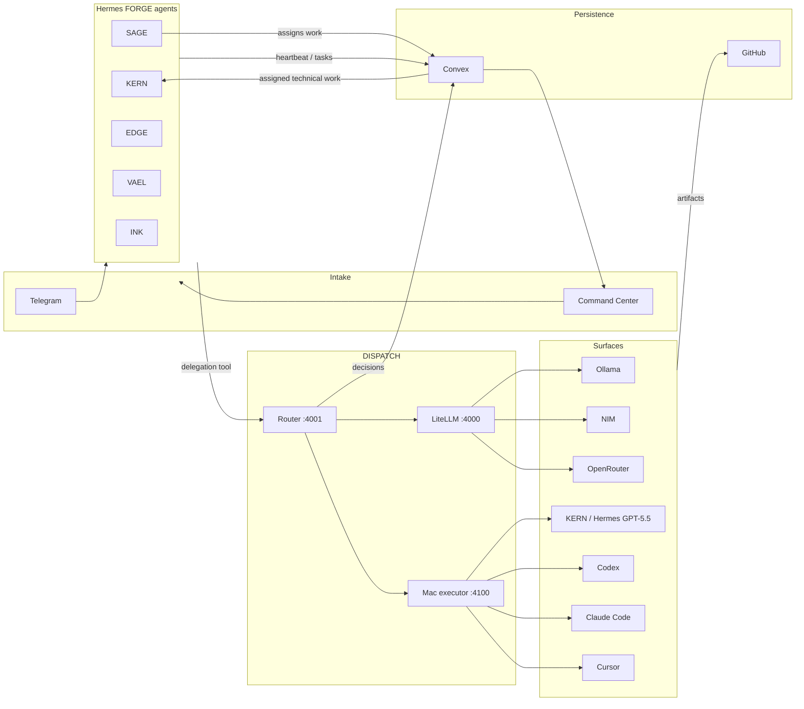

# FORGE Native Execution Plan (Lean)

Status: active — agreed FORGE execution/work-visibility plan; supersedes the Paperclip/Antfarm-first integration path in `FORGE_PRD_v1.4.md`.
Owner: Samuel (iCHRIS). Orchestration: SAGE. Technical execution: KERN + DISPATCH surfaces.
Last updated: 2026-07-06.

Pairs with:

- `docs/DISPATCH_HANDOFF.md` — live infrastructure, endpoints, and build state
- `docs/DISPATCH_BUILD_PLAN.md` — DISPATCH routing phases (0–7); routing is largely done
- `docs/FORGE_OPERATING_MODEL.md` — four-layer mental model, billing philosophy, memory scopes
- `dispatch/dispatch.config.yaml` — tier/surface policy (edit data, not code)

## One-line architecture

**Telegram + Command Center → SAGE orchestration → Convex Work Registry → executor agents/surfaces (KERN, Codex, Claude Code, Cursor, Hermes-GPT5.5, Ollama/NIM/OpenRouter) → GitHub audit + Convex execution ledger → Command Center visibility.**

Hermes owns intake, scheduling, skills, and agent identity. SAGE owns priority/orchestration. KERN is a technical executor, not the global orchestrator. Claude-family models own planning/security/design intelligence. DISPATCH owns deterministic tier selection and executor failover. Convex owns private durable work state and reactive UI. GitHub remains the code/PR audit layer.

## Four-layer operating model

The active mental model lives in `docs/FORGE_OPERATING_MODEL.md`:

1. **Intelligence** — Claude models plan and make architecture/security/design decisions. Codex/GPT-5.5 is a peer for security-tagged work; Gemini CLI is UI/design planning and implementation only (never backend logic or infrastructure).
2. **Execution / Routing** — DISPATCH classifies, checks live availability, walks the ranked tier chain, and logs fallback decisions. UI/front-end work routes to the `execution_ui_design` tier with a VAEL-first gate (see below).
3. **Research / Work** — Hermes Agent is the round-the-clock worker: cron scheduling, webhooks/intake, tools, sessions, and compounding skills.
4. **Self / Memory** — keep codebase memory MCP untouched for project/code context; add a separate Obsidian-compatible markdown vault for business/personal/strategic context.

Billing tiebreaker:

```yaml
billing_order: [subscription, free_local, free_api, metered]
```

Hard rule: refactoring, infrastructure, and production-touching work skips the free-tier attempt and goes straight to a subscription tool.



## What is critical path vs reference-only

| Layer | Role | Critical path? |
|-------|------|----------------|
| **Hermes** | Live fleet, Telegram, cron, skills, sessions | **Yes** |
| **DISPATCH** | Tier-aware routing, failover, subscription-first billing | **Yes** |
| **Mac executor** | Headless Claude Code / Codex / Cursor in repo `cwd` | **Yes** |
| **LiteLLM** | API gateway for Ollama, NIM, OpenRouter, metered fallbacks | **Yes** |
| **Convex** | Work registry, routing log, live agent status, domain data | **Yes** |
| **Command Center** | Visibility, intake UI, domain dashboards (this repo) | **Yes** |
| **GitHub** | Hosted repos, PRs, issues if useful, audit trail for shipped code | **Yes** |
| **Antfarm** | Multi-step CI-style agent pipelines (`plan → implement → verify → PR`) | **No** — keep workflow *patterns* (gates, retries, schema validation); implement a lightweight runner in Convex/Hermes when needed |
| **Paperclip** | Company OS (org, tickets, budgets, heartbeat, audit) | **No** — keep the *concepts*; build a lean **Convex FORGE Work Registry** first instead of running Paperclip as backend |

Do not block shipping on Antfarm install or Paperclip onboarding. When those patterns help, copy the shape into FORGE-native tables and Hermes skills. Do not introduce Linear or a self-hosted GitHub replacement as required infrastructure: work tracking is private in Convex, while code/PR audit stays on GitHub.

## Minimal stack

Everything else is optional glue.

1. **Hermes** — `~/.hermes` → `Forge Core/.hermes`. Profiles: sage, kern, edge, vael, ink (+ scout idle).
2. **DISPATCH** — `dispatch/` in this repo; deployed LXC `192.168.1.178:4001`.
3. **Mac executor** — `dispatch/executor/executor.py`; live copy `~/.dispatch-executor/` on Mac `192.168.1.170:4100`.
4. **LiteLLM** — homelab LXC `:4000`; config `/opt/litellm/config.yaml`.
5. **Convex** — `convex/` in this repo; self-hosted on homelab LXC `forge-convex` (`192.168.1.179`, Phase B).
6. **Command Center** — Vite + React 19 SPA; `npm run dev`, routes under `src/pages/`.
7. **GitHub** — client repos + this repo; PRs/issues are the external code audit and collaboration layer. No Forgejo/Gitea/GitLab self-hosting path for now.

## Operating rule: who does what

**SAGE orchestrates.** SAGE owns priority, sequencing, assignment, and escalation decisions.

**KERN is a technical executor surface.** KERN has the same *class* of role as Codex CLI, Claude Code, and Cursor: KERN may plan locally inside an assigned technical task, inspect code, modify files, run checks, verify output, and report completion/blockers, but does not own global roadmap priority.

**DISPATCH executor surfaces implement coding and client work** — discrete, routable tasks with a clear prompt and optional `cwd`/`repo`:

- `kern-hermes-gpt55` / `hermes-kern-gpt55` — KERN running through Hermes with OpenAI-Codex GPT-5.5 credential pool; primary fallback when Codex CLI is rate-limited or read-only.
- `codex-cli-gpt55` — Codex CLI with explicit `gpt-5.5`, repo `cwd`, and writable workspace mode.
- `claude-code` — Claude Code CLI when session/quota allows.
- `cursor` / `cursor-pinned` — Cursor Agent executor; also design-compliance verifier in `execution_ui_design`.
- `gemini-cli` — Gemini CLI; **UI/design only** (planning tier + `execution_ui_design` primary/verifier). Not for backend or infrastructure.
- `ollama` / `nim` / `openrouter` — local/API fallback surfaces.

Executor obligations:

- Accept assigned work from SAGE/Convex/Command Center.
- Call DISPATCH via `dispatch-delegate` skill or `dispatch/dispatch_delegate.py` when another surface should implement.
- Verify output (lint, smoke test, build, diff review).
- Apply/commit/PR when correct, or report blocker to SAGE with evidence.
- Keep `docs/DISPATCH_HANDOFF.md` current after infrastructure changes.

**Do not point Hermes agent model backends at DISPATCH.** Agents stay tool-calling on their subscription backend; DISPATCH is invoked as a **delegation tool** for specific tasks (see gotcha #1 in `DISPATCH_HANDOFF.md`).

### UI/design execution gate (`execution_ui_design`)

UI, front-end, and design-system work is a separate DISPATCH tier — not routine execution. Policy lives in `dispatch/dispatch.config.yaml` under `execution_ui_design`; the router classifies matching tasks when UI keywords co-occur with execution intent.

| Step | Actor | Role |
|------|-------|------|
| 1 — before implementation | **VAEL** | `design_authority`: sets direction, brief, and brand/design-system constraints |
| 2 — implementation | **Gemini 3.5 Flash** (`gemini-cli`) | Primary UI/design code worker; implements against VAEL's brief |
| 3 — compliance check | **Gemini 3.1 Pro Preview** (`gemini-cli`) | Preferred `design_compliance_verification`; checks output against VAEL's brief (not taste overrides) |
| 3 — compliance fallback | **Cursor** (`composer-2.5`) | Secondary verifier when Gemini compliance is unavailable |
| 4 — high-stakes sign-off | **VAEL** | `final_design_approval` after verification when task complexity is `high_stakes` |

Hard rules:

- **VAEL before code** — no Gemini UI implementation until VAEL has set design direction.
- **Gemini scope** — Gemini CLI is reserved for UI/design planning and UI/design code only; backend logic, infrastructure, and refactor tiers must not use Gemini as primary or verifier.
- **Verifiers check compliance, not taste** — Gemini 3.1 Pro Preview and Cursor verify against VAEL's brief; they do not override brand or design-authority decisions.

Free-tier recovery (`ollama`, `openrouter`) exists at the end of the chain for cost fallback only; subscription verification still applies.

## Phases A–F

These are the FORGE-native roadmap. DISPATCH build phases 0–7 (in `DISPATCH_BUILD_PLAN.md`) remain the routing sub-plan; many are already done.

### Phase A — First-class executor delegation

**Goal:** SAGE can assign work; KERN and other executor agents can execute or delegate bounded tasks to DISPATCH with repo context.

| Item | Status | Location |
|------|--------|----------|
| Router + LiteLLM + executor live | Done | `dispatch/`, LXC, Mac |
| `dispatch_delegate.py` CLI | Done | `dispatch/dispatch_delegate.py` |
| `cwd`/`repo` forwarding | Done | `dispatch/executor/executor.py`, router, service |
| Hermes `dispatch-delegate` skill (KERN) | Done | `~/.hermes/profiles/kern/skills/devops/dispatch-delegate/SKILL.md` |
| Copy orchestration/delegation visibility to SAGE | **Next** | Hermes profile skills dirs |
| Add `hermes-kern-gpt55` executor surface | **Next** | `dispatch/executor/executor.py`, router/service config |
| Patch Codex CLI surface for writable `gpt-5.5` execution | **Next** | `dispatch/executor/executor.py` |
| Install Mac executor LaunchAgent | **Next** | `~/Library/LaunchAgents/ai.forge.dispatch-executor.plist` |
| Re-login Claude/Codex CLIs if auth smoke fails | **As needed** | Mac mini |

**Done when:** SAGE can create/assign work, KERN can execute as a Hermes-GPT5.5 surface or route to Codex/Claude/Cursor, and the result lands in GitHub with Convex logging the execution trail.

### Phase B — Convex FORGE Work Registry

**Goal:** Replace Paperclip/Linear-as-backend with lean private Convex tables for FORGE work tracking, without external task-manager dependency.

**New tables** (extend `convex/schema.ts`):

- `workItems` — id, title, description, source (telegram|command-center|cron|agent|github), state (inbox|backlog|ready|running|review|done|blocked|cancelled), priority, domain/clientId?, orchestratorAgent (`sage`), ownerAgent (`kern`/`vael`/`edge`/`ink`), repo?, branch?, githubIssue?, githubPR?, currentDispatchRunId?, blockedReason?, createdAt, updatedAt
- `workEvents` — workItemId, kind (created|assigned|delegated|routed|completed|failed|verified|blocked|comment|github_linked), actor, payload, createdAt (audit trail)
- `routingDecisions` — mirror DISPATCH log (taskId, category, complexity, chosenSurface, via, servedBy, latencyMs, status, considered[], createdAt)
- `agentHeartbeats` — extend or align with existing `agentStatus` (agentId, status, note, actionsToday, lastHeartbeatAt)
- `executorRuns` — workItemId, surface, model, cwd/repo, status, startedAt, completedAt, verificationSummary, artifactUrls

**Integrations:**

- DISPATCH router or a thin Convex action ingests `/decisions` or pushes on each route
- Hermes agents upsert heartbeats and transition `workItems` on assign/delegate/verify/complete
- GitHub PR/issue URLs attach to `workItems`, but GitHub is not the task database
- Command Center `/tasks` page reads Convex reactively as the Work Registry cockpit

**Done when:** A task created in Command Center or via Telegram appears in Convex, SAGE assignment and executor progress are visible, GitHub links attach when code changes exist, and no Linear/Paperclip required.

### Phase C — Execution cockpit

**Goal:** Single pane for routing history, surface health, and active work.

| Surface | Path | Data source |
|---------|------|-------------|
| DISPATCH panel | `/dispatch` | `GET :4001/decisions`, `GET :4001/surfaces` |
| Tasks / Work cockpit | `/tasks` | Convex `workItems`, `workEvents`, `executorRuns`, GitHub issue/PR links |
| Agent map | `/bots` | Convex `agentStatus` + Hermes roster |
| Status CLI | — | `python3 dispatch/dispatch_status.py` |

**Done when:** Operator sees who is doing what, what is blocked, what surface/model executed, verification state, GitHub PR/issue links, recent routes, and active work without SSH.

### Phase D — Lightweight workflow runner

**Goal:** Antfarm-style multi-step flows without Antfarm daemon dependency.

Pattern (from Antfarm, implemented in FORGE):

1. Define workflow as data in Convex (`workflows`: name, steps[], gate schema)
2. Hermes cron or Convex scheduled function advances one step per tick
3. Each step delegates execution to DISPATCH; verification gate checks output schema or test command
4. Terminal states: `done` | `blocked` — surface to SAGE/KERN

Reference only: `~/.openclaw/workspace/antfarm/` workflow YAML shapes; do not require Antfarm install.

**Done when:** One workflow (e.g. `doc-fix`: triage → delegate → verify → commit) runs end-to-end via Convex + Hermes cron.

### Phase E — Agent governance

**Goal:** Budget, quota, and audit concepts from Paperclip, native in Convex.

- `toolQuota` / `toolAvailability` — surface caps and health (see `DISPATCH_BUILD_PLAN.md` schema sketch)
- Per-agent daily action counters (already partially in `agentStatus`)
- `workEvents` as immutable audit log
- Alerts when subscription surfaces hit `over_cap` or metered spill is frequent

**Done when:** Command Center shows quota burn and governance alerts; no external budget service.

### Phase F — Domain dashboards

**Goal:** Wire existing domain pages to Convex live data (trading, P2P, sites, money, content) with work registry cross-links.

Existing routes: `src/pages/TradingOps.tsx`, `TradingP2P.tsx`, `WebOps.tsx`, `Money.tsx`, `Content.tsx`, etc. Schema stubs exist in `convex/trading.ts`, `p2p.ts`, `sites.ts`, `money.ts`.

**Done when:** Each domain dashboard reads Convex when `USE_CONVEX_MOCK` is false; work items can be tagged by domain.

## Convex FORGE Work Registry (Paperclip concepts, lean)

Map Paperclip ideas to Convex without running Paperclip:

| Paperclip concept | FORGE-native home |
|-------------------|-------------------|
| Org / departments | Hermes profiles + static roster in Command Center |
| Tickets / tasks | `workItems` in Convex; GitHub issues optional/linkable, not primary |
| Clients | `clients` table or `workItems.clientId` |
| Budget / quotas | `toolQuota` + subscription cap tracking in DISPATCH |
| Heartbeat | `agentStatus` / `agentHeartbeats` |
| Audit log | `workEvents` + `executorRuns` + `routingDecisions` + GitHub commits/PRs |

Build this before considering Paperclip or Linear integration. Linear can remain an optional future adapter, but it is not part of the agreed private-first plan.

## Endpoints (health-check first)

| Service | URL | Notes |
|---------|-----|-------|
| LiteLLM | `http://192.168.1.178:4000/health/liveliness` | API model gateway |
| DISPATCH | `http://192.168.1.178:4001/health` | Router service |
| DISPATCH models | `GET http://192.168.1.178:4001/v1/models` | OpenAI-compatible |
| DISPATCH decisions | `GET http://192.168.1.178:4001/decisions` | Panel + future Convex ingest |
| DISPATCH surfaces | `GET http://192.168.1.178:4001/surfaces` | Live availability |
| DISPATCH chat | `POST http://192.168.1.178:4001/v1/chat/completions` | `model: dispatch-auto`, optional `cwd` |
| Mac executor | `http://192.168.1.170:4100/health` | Bearer token required |
| Mac executor run | `POST http://192.168.1.170:4100/run` | `surface`, `prompt`, `cwd` |
| Ollama | `http://192.168.1.170:11434/api/tags` | Local models on Mac |
| Command Center dev | `npm run dev` → `/tasks`, `/dispatch`, `/bots` | `VITE_DISPATCH_URL`, `VITE_CONVEX_URL` |

## Repo map (this repository)

| Path | Purpose |
|------|---------|
| `dispatch/dispatch.config.yaml` | Routing policy — edit tiers here (`execution_ui_design` = VAEL-first UI gate) |
| `dispatch/router/dispatch_router.py` | Classify, select, route, SQLite log |
| `dispatch/router/dispatch_service.py` | OpenAI-compatible HTTP service |
| `dispatch/executor/executor.py` | Mac CLI executor (source of truth) |
| `dispatch/dispatch_delegate.py` | CLI delegation helper |
| `dispatch/dispatch_status.py` | All-services health check |
| `convex/schema.ts` | DB schema — extend for Work Registry |
| `convex/agents.ts` | Agent heartbeat queries |
| `src/pages/Dispatch.tsx` | DISPATCH cockpit (Phase C) |
| `src/pages/Tasks.tsx` | Tasks / Work Registry cockpit |
| `src/pages/BotTeam.tsx` | Neural command map / agents |
| `src/App.tsx` | Routes and shortcuts (`g d` → dispatch) |
| `docs/DISPATCH_HANDOFF.md` | Live ops handoff log |
| `docs/DISPATCH_BUILD_PLAN.md` | DISPATCH phases 0–7 detail |

## Immediate next checklist

Execute in order; check off in `docs/DISPATCH_HANDOFF.md` when done.

- [x] **Commit `convex/`, `dispatch/`, `docs/` to GitHub** — branch `dispatch-continuation-20260705` has PR #1 open; keep this plan committed with follow-up changes.
- [x] **Expose SAGE orchestration path** — SAGE creates/assigns `workItems`; KERN appears as executor, not orchestrator.
- [x] **Add `hermes-kern-gpt55` executor surface** — use Hermes OpenAI-Codex GPT-5.5 credential pool as a DISPATCH executor fallback.
- [x] **Patch Codex CLI surface** — explicit `gpt-5.5`, repo `cwd`, writable workspace mode.
- [x] **Install Mac executor LaunchAgent** — keep `:4100` alive across restarts/logouts.
- [ ] **Re-auth Claude Code on Mac** when session limit clears; Codex/Cursor/Hermes-GPT5.5 should cover fallback execution.
- [x] **Add Convex `workItems` + `workEvents` + `routingDecisions` + `executorRuns` tables** — `convex/schema.ts`, mutations in `convex/work.ts` (new).
- [x] **Ingest DISPATCH decisions into Convex** — `dispatch-convex-sync.service` polls DISPATCH registry/runtime/decisions/verification jobs and syncs them into Convex.
- [x] **Build `/tasks` cockpit** — board/list/detail timeline from Convex; show owner agent, orchestrator, status, surface/model, GitHub issue/PR, blockers, verification.
- [x] **Self-host Convex on homelab** — Docker on forge-node-01; set `VITE_CONVEX_URL` / `CONVEX_SELF_HOSTED_URL` (Phase B infra). LXC `forge-convex` at `192.168.1.179`, backend `:3210`, site `:3211`, dashboard `:6791`.
- [ ] **Telegram intake → `workItems`** — intentionally gated behind the running main SAGE Hermes gateway; the generic FORGE poller exists for future fleet/group behavior but must not compete for the same bot token.
- [ ] **Rotate shared Telegram bot tokens** before enabling any direct FORGE phone intake (hazard: archived OpenClaw shares tokens with live Hermes).
- [x] **Fix pre-existing frontend TS errors** — `npm run lint` and `npm run build` pass for deploy.

## Success criteria (30-day)

1. Task enters via Telegram or Command Center → appears in Convex work registry.
2. SAGE assigns owner/executor; KERN appears as technical executor, not global orchestrator.
3. KERN can execute directly through Hermes-GPT5.5 or route to Codex/Claude/Cursor via DISPATCH.
4. Routing decision, executor run, verification, blocker, and work state are visible in Command Center `/tasks` without manual log diving.
5. No Antfarm, Paperclip, Linear, or self-hosted Git replacement required for the loop.
6. GitHub PR/commit/issue links are the code audit artifacts; Convex is the private operations audit.

## References

- Hermes fleet: `Forge Core/.hermes`
- Antfarm workflow shapes (reference): `~/.openclaw/workspace/antfarm/`
- PRD (historical Paperclip path): `FORGE_PRD_v1.4.md` — execution sections superseded by this doc
